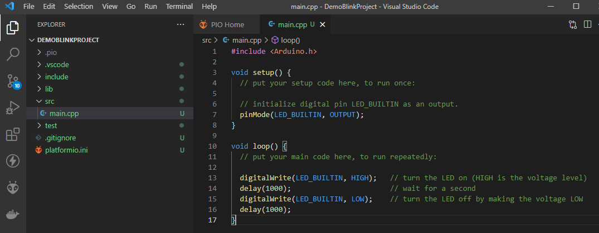
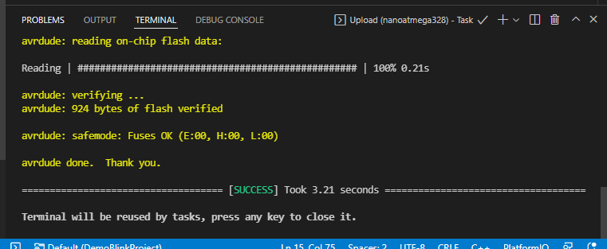
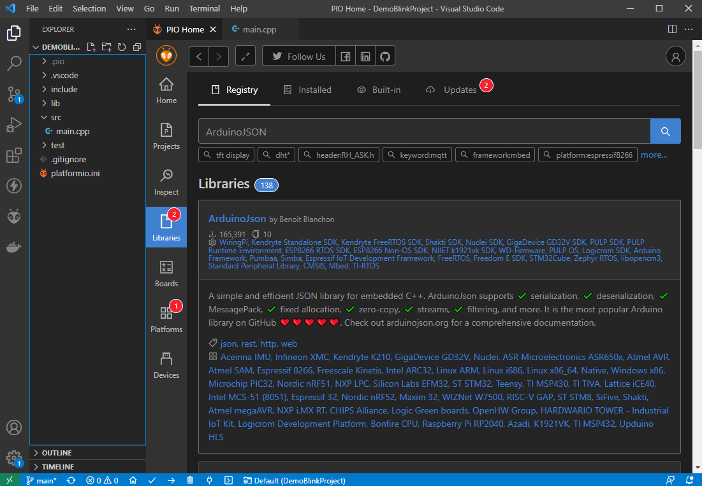
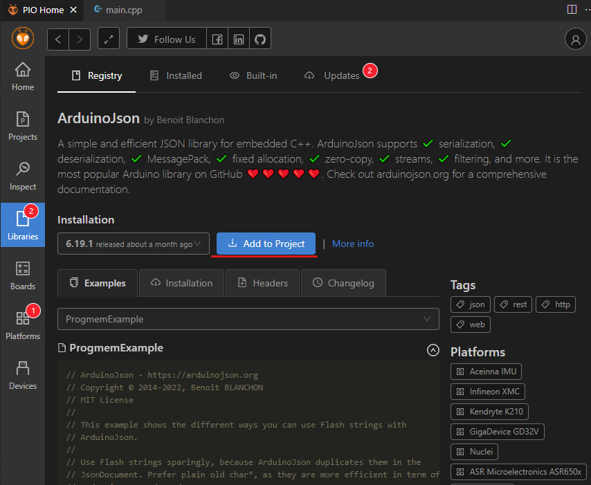
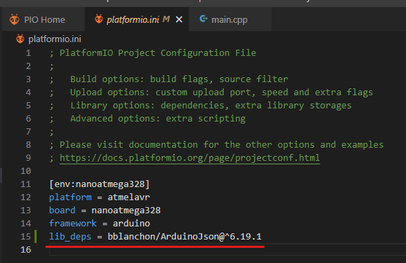

# PlatformIO Demo
Repository to aid a live demo of how to use PlatformIO for the SunrIde Training Programme.

Contents:

- [PlatformIO Demo](#platformio-demo)
- [What is PlatformIO](#what-is-platformio)
- [How to use PlatformIO](#how-to-use-platformio)
  - [`platformio.ini` - Project Configuration File](#platformioini---project-configuration-file)
  - [Arduino blink code - `src/main.cpp`](#arduino-blink-code---srcmaincpp)
  - [Uploading your code to an Arduino](#uploading-your-code-to-an-arduino)
    - [Use PlatformIO user interface](#use-platformio-user-interface)
    - [Use keyboard shortcut](#use-keyboard-shortcut)
    - [Use the command line](#use-the-command-line)
  - [Installing and using libraries](#installing-and-using-libraries)
    - [Install library using PlatformIO Home](#install-library-using-platformio-home)
    - [Install library manually](#install-library-manually)

# What is PlatformIO

On the Avionics team for Project Sunride, one of our tasks is the programming of the flight computer of the rocket. In the past, the Arduino IDE was used.

PlatformIO is a much better way of programming microcontrollers than the Arduino IDE. It is described as a “professional collaborative platform for embedded development”. It has many features that we can use to improve the quality of the code we write, and to work together as a team. 

# How to use PlatformIO

First, make sure that [VS Code](https://code.visualstudio.com/download) is installed with the [PlatformIO extension](https://marketplace.visualstudio.com/items?itemName=platformio.platformio-ide) 

You can install the PlatformIO extension for VS code by searching for it in the "Extensions" tab on the left


After installing PlatformIO to VS Code, you can create a new project by navigating to the PlatformIO tab on the left.

You can then open PIO Home (or it will open automatically)

To create a new project, click `new project`, then use the wizard to specify the name, board, framework and location for your project.


VS Code will then open this project for you, or you can open it manually like any other project.

## `platformio.ini` - Project Configuration File

Based on the settings above, a configuration file would be generated that looks like this:

```ini
; Please visit documentation for options and examples
; https://docs.platformio.org/page/projectconf.html

[env:nanoatmega328]
platform = atmelavr
board = nanoatmega328
framework = arduino
```

The configuration file is split into sections, denoted by a `[header]`. Each section contains key/value pairs. Comments can be written in the file by using the `;` character.

Each project can have different _configuration environments_. These are declared using `[env:<name>]` sections. In the example above, one environment is defined, and it is called `nanoatmega328`. The environment definition contains 3 key-value pairs, which define the `platform`, `board`, and `framework` that the environment shall use. The project setup wizard chose these values for me when I selected the Arduino Nano board, but if you want to use another board you can do so by referring to the [PlatformIO boards documentation](https://docs.platformio.org/en/latest//boards/index.html).


## Arduino blink code - `src/main.cpp`



The default entry point to our project is found in the `src` folder and is called `main.cpp`. It is here where we can write our Arduino code. As shown in the screenshot, add code for the Arduino Blink project to this file.

```cpp
#include <Arduino.h>

void setup() {
  // put your setup code here, to run once:

  // initialize digital pin LED_BUILTIN as an output.
  pinMode(LED_BUILTIN, OUTPUT);
}

void loop() {
  // put your main code here, to run repeatedly:

  digitalWrite(LED_BUILTIN, HIGH);   // turn the LED on (HIGH is the voltage level)
  delay(1000);                       // wait for a second
  digitalWrite(LED_BUILTIN, LOW);    // turn the LED off by making the voltage LOW
  delay(1000);    
}
```

## Uploading your code to an Arduino

Make sure that the arduino is plugged in to your computer via USB. Following this, you can build and upload your code by using the PIO Upload command.

In VS code, this can be done in three different ways:

- [Use PlatformIO user interface](#use-platformio-user-interface)
- [Use keyboard shortcut](#use-keyboard-shortcut)
- [Use the command line](#use-the-command-line)

### Use PlatformIO user interface

Click on the PlatformIO tab, then click on the `Upload` task for the `nanoatmega328` environment.


You will then see a command window appear, which after a few seconds should say `SUCCESS`



### Use keyboard shortcut

In VS code, you can use the keyboard shortcut `CTRL+ALT+U` to upload your code.

### Use the command line

You can start a command line session within the PIO environment by clicking here:


Then run the command

    pio run -t upload


## Installing and using libraries

The [PlatformIO Registry](https://registry.platformio.org/) contains over 10,000 libraries from software vendors, open-source projects, and the community.

One of the featured libraries is ArduinoJSON, which is the most popular Arduino libray on GitHub.

The installation page for the library can be found [here](https://registry.platformio.org/libraries/bblanchon/ArduinoJson/installation). This page shows how the library can be installed manually, but we can also use the PlatformIO Home UI to do this.


### Install library using PlatformIO Home






### Install library manually

The above example adds this line to `platformio.ini`. You can do this manually, by referring to the [installation page](https://registry.platformio.org/libraries/bblanchon/ArduinoJson/installation) of the library



The library page also contains an [examples](https://registry.platformio.org/libraries/bblanchon/ArduinoJson/examples) section, which you can refer to when understanding how to use the library.